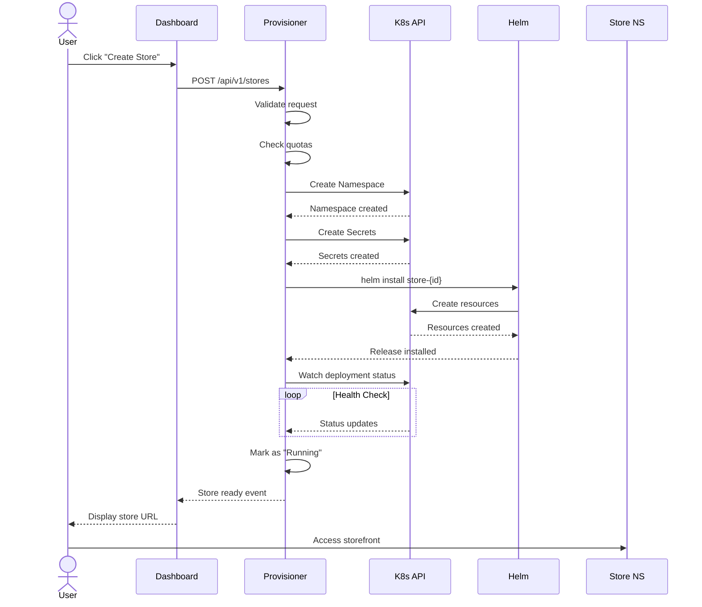
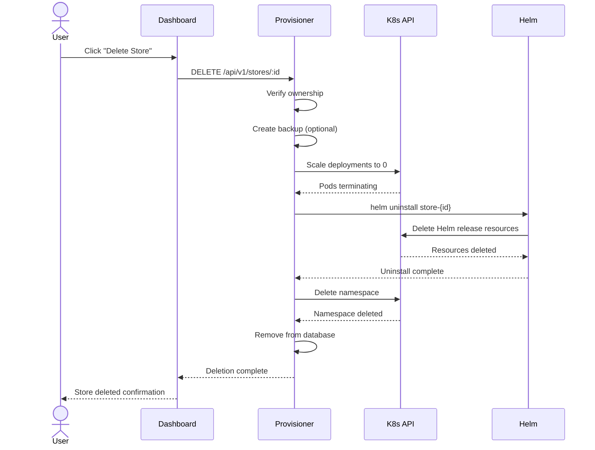
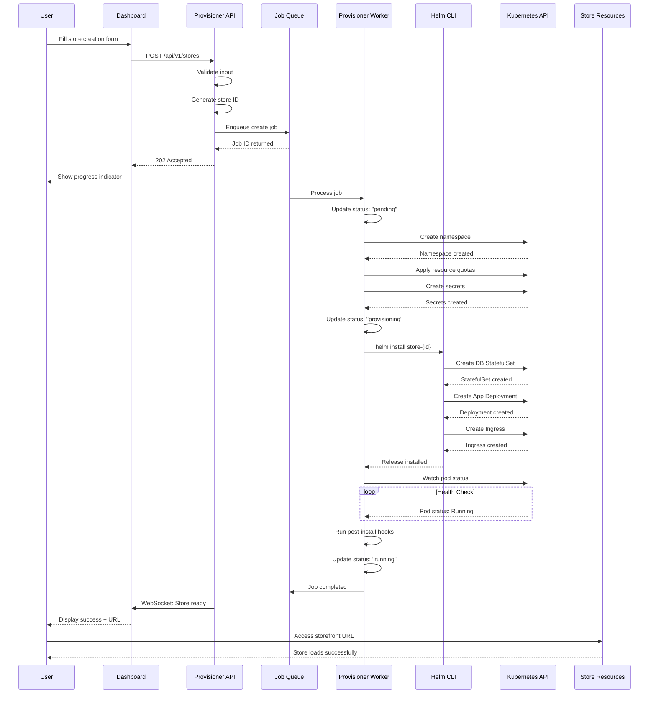

# Architecture

## High-Level System Overview

The Store Provisioning Platform follows a microservices architecture deployed on Kubernetes, with clear separation between the control plane (platform components) and data plane (individual store instances). Each store operates in complete isolation within its own namespace.

```
┌─────────────────────────────────────────────────────────────┐
│                      User Browser                           │
└──────────────────────┬──────────────────────────────────────┘
                       │ HTTPS
                       ▼
┌─────────────────────────────────────────────────────────────┐
│                   Ingress Controller                         │
│            (nginx-ingress / NGINX Ingress Controller)        │
└──────────────────────┬──────────────────────────────────────┘
                       │
         ┌─────────────┴─────────────┐
         │                           │
         ▼                           ▼
┌─────────────────┐      ┌──────────────────┐
│   Dashboard     │      │   Store Instance │
│  (React + Nginx)│      │   (WooCommerce/  │
│                 │      │    MedusaJS)     │
└────────┬────────┘      └────────┬─────────┘
         │                        │
         ▼                        ▼
┌─────────────────┐      ┌──────────────────┐
│  Provisioner    │      │   Database       │
│   API           │      │  (MySQL/PGSQL)   │
│  (Node.js)      │      │                  │
└────────┬────────┘      └──────────────────┘
         │
         ▼
┌─────────────────┐
│  Kubernetes API │
│   Server        │
└─────────────────┘
```

## Component Breakdown

### 1. Dashboard (React Application)

**Purpose:** User-facing web interface for store management

**Technology Stack:**
- React 18+ with TypeScript
- React Query for server state management
- React Router for navigation
- Tailwind CSS for styling
- Axios for API calls
- WebSocket for real-time updates

**Responsibilities:**
- Display store list with status
- Store creation wizard
- Store details and management
- Activity logs and metrics
- User authentication (optional Round 1)

**Deployment:**
- Nginx serving static build
- ConfigMap for runtime configuration
- Ingress for external access

### 2. Backend / Provisioner API

**Purpose:** Orchestration layer between dashboard and Kubernetes

**Technology Stack:**
- Node.js with Express/Fastify
- @kubernetes/client-node for K8s API
- Helm.js or shell exec for Helm operations
- PostgreSQL for state persistence
- Bull/Agenda for job queues

**Responsibilities:**
- Store lifecycle management
- Helm release orchestration
- Status monitoring and aggregation
- Event streaming to dashboard
- Validation and quota enforcement

**API Endpoints:**
```
GET    /api/v1/stores          # List all stores
POST   /api/v1/stores          # Create new store
GET    /api/v1/stores/:id      # Get store details
DELETE /api/v1/stores/:id      # Delete store
GET    /api/v1/stores/:id/logs # Stream logs
GET    /health                 # Health checks
```

### 3. Kubernetes Cluster

**Purpose:** Container orchestration and resource management

**Local (k3d/kind/minikube):**
- Single-node acceptable
- 8GB RAM minimum
- Docker or containerd runtime

**Production (k3s VPS):**
- Multi-node recommended
- 16GB+ RAM
- SSD storage
- Private networking

**Required Add-ons:**
- cert-manager (TLS certificates)
- nginx-ingress (traffic routing)
- metrics-server (resource monitoring)

### 4. Helm Charts

**Purpose:** Declarative, versioned deployments

**Chart Hierarchy:**
```
store-platform/              # Umbrella chart
├── dashboard/               # Frontend subchart
├── provisioner/             # Backend API subchart
└── store-engine/            # Template for stores

store-instance/              # Dynamic store chart
├── templates/
│   ├── namespace.yaml
│   ├── database/
│   │   ├── statefulset.yaml
│   │   ├── service.yaml
│   │   └── pvc.yaml
│   ├── application/
│   │   ├── deployment.yaml
│   │   ├── service.yaml
│   │   └── ingress.yaml
│   └── secrets.yaml
└── values.yaml
```

### 5. Ingress Controller

**Purpose:** HTTP/HTTPS routing and TLS termination

**Local Configuration:**
- Host: `*.127.0.0.1.nip.io`
- TLS: Self-signed certificates
- Class: nginx

**Production Configuration:**
- Host: `*.stores.example.com`
- TLS: Let's Encrypt
- Rate limiting enabled
- Annotations for caching

### 6. Storage

**Types:**
- **Local Path (k3d/kind):** HostPath or local provisioner
- **Production:** Cloud provider CSI (AWS EBS, GCP PD, etc.) or Longhorn

**PVCs per Store:**
- Database: 10-50Gi (SSD recommended)
- Uploads: 5-20Gi (optional S3 for production)

## Multi-Store Isolation Model

### Namespace-Per-Store Architecture

```
Namespace: store-platform
├── Deployment: dashboard
├── Deployment: provisioner
├── Service: dashboard
├── Service: provisioner
└── Ingress: dashboard

Namespace: store-abc123
├── StatefulSet: abc123-db
├── Deployment: abc123-app
├── Service: abc123-db
├── Service: abc123-app
├── Ingress: abc123-store
├── PVC: data-abc123-db-0
├── PVC: abc123-uploads
└── Secret: abc123-credentials

Namespace: store-def456
├── StatefulSet: def456-db
├── Deployment: def456-app
├── Service: def456-db
├── Service: def456-app
├── Ingress: def456-store
├── PVC: data-def456-db-0
├── PVC: def456-uploads
└── Secret: def456-credentials
```

### Isolation Mechanisms

**Network Isolation:**
```yaml
apiVersion: networking.k8s.io/v1
kind: NetworkPolicy
metadata:
  name: store-isolation
spec:
  podSelector: {}
  policyTypes:
    - Ingress
    - Egress
  ingress:
    - from:
        - namespaceSelector:
            matchLabels:
              name: store-platform
        - podSelector: {}
  egress:
    - to: []
```

**Resource Quotas:**
```yaml
apiVersion: v1
kind: ResourceQuota
metadata:
  name: store-quota
spec:
  hard:
    requests.cpu: "2"
    requests.memory: 4Gi
    limits.cpu: "4"
    limits.memory: 8Gi
    persistentvolumeclaims: "2"
```

**RBAC per Store:**
- ServiceAccount with minimal permissions
- Role scoped to specific namespace
- RoleBinding for provisioner access

## Provisioning Workflow

### Step-by-Step Process



### Detailed Steps

1. **Request Validation**
   - Check store name uniqueness
   - Validate against naming conventions
   - Verify user quotas
   - Sanitize input parameters

2. **Namespace Creation**
   - Generate unique store ID (UUID short form)
   - Create namespace with labels
   - Apply resource quotas
   - Create service account

3. **Secret Generation**
   - Generate database credentials
   - Generate application secrets (salts, keys)
   - Create Kubernetes Secrets
   - Store reference in provisioner DB

4. **Helm Installation**
   - Render templates with store-specific values
   - Apply database StatefulSet first
   - Wait for DB readiness
   - Apply application Deployment
   - Create Ingress rules

5. **Health Verification**
   - Poll readiness probes
   - Verify ingress accessibility
   - Check database connectivity
   - Validate application endpoints

6. **Completion**
   - Update store status to "Running"
   - Generate access credentials
   - Send notification (WebSocket/email)
   - Log provisioning event

## Deletion Workflow

### Step-by-Step Process



### Detailed Steps

1. **Confirmation**
   - Display warning about data loss
   - Require store name confirmation
   - Optional: Offer data export

2. **Pre-Deletion**
   - Scale deployments to 0
   - Create final backup (if configured)
   - Revoke any external access

3. **Helm Uninstall**
   - Remove all chart resources
   - Wait for PVC deletion (respect retention policy)
   - Verify no orphaned resources

4. **Namespace Cleanup**
   - Delete namespace (cascading delete)
   - Verify complete removal
   - Clean up any manual resources

5. **State Cleanup**
   - Remove from provisioner database
   - Clean up DNS records (external)
   - Archive logs (optional)
   - Update dashboard

## Concurrency and Idempotency

### Concurrent Provisioning

**Challenge:** Multiple stores provisioning simultaneously

**Solution:**
- Queue-based job processing (Bull/Bee Queue)
- Job status tracking
- Resource quota enforcement
- Parallel Helm operations (Helm 3 is thread-safe)

**Implementation:**
```javascript
// Job queue example
const createStoreQueue = new Queue('create-store', redisConfig);

createStoreQueue.process(async (job) => {
  const { storeId, config } = job.data;
  
  // Update progress
  job.progress(10);
  
  // Create namespace
  await createNamespace(storeId);
  job.progress(30);
  
  // Install Helm release
  await helmInstall(storeId, config);
  job.progress(60);
  
  // Wait for readiness
  await waitForReady(storeId);
  job.progress(100);
  
  return { storeId, status: 'running' };
});
```

### Idempotency

**Guarantees:**
- Helm releases are idempotent by default
- Namespace creation is idempotent
- Secret updates are atomic

**Implementation:**
```yaml
# Namespace with idempotent labels
apiVersion: v1
kind: Namespace
metadata:
  name: {{ .Values.store.id }}
  labels:
    app.kubernetes.io/name: store
    app.kubernetes.io/instance: {{ .Values.store.name }}
    app.kubernetes.io/part-of: store-platform
    store.platform.io/id: {{ .Values.store.id }}
```

## Failure Recovery and Rollback

### Failure Detection

**Health Checks:**
- Readiness probe failures
- Liveness probe failures
- Helm release status checks
- Database connectivity checks

**Monitoring:**
- Kubernetes Events watcher
- Pod status monitoring
- Resource utilization alerts

### Recovery Strategies

**Transient Failures:**
- Automatic pod restart (Kubernetes default)
- Exponential backoff for retries
- Circuit breaker pattern

**Persistent Failures:**
- Rollback to previous Helm revision
- Complete re-provisioning
- Manual intervention for data issues

### Rollback Implementation

```javascript
// Rollback on failure
async function handleProvisioningFailure(storeId, error) {
  logger.error(`Provisioning failed for ${storeId}`, error);
  
  // Update status
  await updateStoreStatus(storeId, 'failed', error.message);
  
  // Attempt rollback
  try {
    await helmRollback(storeId, 0); // Rollback to revision 0 (pre-install)
    logger.info(`Rolled back ${storeId}`);
  } catch (rollbackError) {
    logger.error(`Rollback failed for ${storeId}`, rollbackError);
    // Manual cleanup required
    await flagForManualCleanup(storeId);
  }
  
  // Notify user
  await notifyUser(storeId, 'provisioning_failed', error.message);
}
```

## Store Engine Abstraction

### Engine Interface

All store engines implement a common interface:

```typescript
interface StoreEngine {
  name: string;
  version: string;
  
  // Resource requirements
  getResourceRequirements(): ResourceRequirements;
  
  // Database configuration
  getDatabaseConfig(): DatabaseConfig;
  
  // Container images
  getImages(): ContainerImages;
  
  // Health check endpoints
  getHealthChecks(): HealthCheckConfig;
  
  // Environment variables
  getEnvironmentVariables(): Record<string, string>;
  
  // Ingress configuration
  getIngressRules(): IngressRule[];
  
  // Post-installation setup
  postInstallHook(storeId: string): Promise<void>;
}
```

### WooCommerce Implementation (Round 1)

```typescript
class WooCommerceEngine implements StoreEngine {
  name = 'woocommerce';
  version = '8.0';
  
  getImages() {
    return {
      app: 'wordpress:6.4-php8.2-apache',
      init: 'store-platform/wp-init:latest'
    };
  }
  
  getDatabaseConfig() {
    return {
      type: 'mysql',
      version: '8.0',
      database: 'wordpress',
      user: 'wordpress'
    };
  }
  
  getHealthChecks() {
    return {
      readiness: { path: '/wp-includes/images/blank.gif', port: 80 },
      liveness: { path: '/wp-includes/images/blank.gif', port: 80 }
    };
  }
}
```

### Medusa Stub (Round 1)

```typescript
class MedusaEngine implements StoreEngine {
  name = 'medusa';
  version = '1.20';
  
  getImages() {
    return {
      server: 'medusajs/medusa:latest',
      admin: 'medusajs/admin:latest',
      storefront: 'medusajs/storefront:latest'
    };
  }
  
  getDatabaseConfig() {
    return {
      type: 'postgres',
      version: '14',
      database: 'medusa',
      user: 'medusa'
    };
  }
  
  // Round 1: Return not implemented error
  async provision() {
    throw new Error('MedusaJS support coming in Round 2');
  }
}
```

## Ingress and Domain Strategy

### Local Development

**DNS Resolution:**
- Use nip.io for automatic wildcard DNS
- Pattern: `{store-name}.127.0.0.1.nip.io`
- No /etc/hosts modifications needed

**Example:**
```yaml
apiVersion: networking.k8s.io/v1
kind: Ingress
metadata:
  name: my-store
spec:
  rules:
    - host: my-store.127.0.0.1.nip.io
      http:
        paths:
          - path: /
            pathType: Prefix
            backend:
              service:
                name: my-store-app
                port:
                  number: 80
```

### Production

**DNS Configuration:**
- Wildcard DNS A record: `*.stores.example.com -> Ingress IP`
- Or individual A records per store

**TLS Configuration:**
```yaml
apiVersion: networking.k8s.io/v1
kind: Ingress
metadata:
  name: my-store
  annotations:
    cert-manager.io/cluster-issuer: letsencrypt-prod
spec:
  tls:
    - hosts:
        - my-store.stores.example.com
      secretName: my-store-tls
  rules:
    - host: my-store.stores.example.com
      http:
        paths:
          - path: /
            pathType: Prefix
            backend:
              service:
                name: my-store-app
                port:
                  number: 80
```

### Subdomain Generation

```javascript
function generateSubdomain(storeName, baseDomain) {
  // Sanitize: lowercase, alphanumeric, hyphens only
  const sanitized = storeName
    .toLowerCase()
    .replace(/[^a-z0-9-]/g, '-')
    .replace(/-+/g, '-')
    .replace(/^-|-$/g, '');
  
  // Add random suffix for uniqueness
  const suffix = Math.random().toString(36).substring(2, 6);
  
  return `${sanitized}-${suffix}.${baseDomain}`;
}

// Examples:
// "My Store" -> "my-store-a1b2.127.0.0.1.nip.io"
// "ACME Corp" -> "acme-corp-x9y8.stores.example.com"
```

## Security Boundaries and RBAC

### RBAC Model

**Platform Components:**
```yaml
# Provisioner ServiceAccount
apiVersion: v1
kind: ServiceAccount
metadata:
  name: provisioner
  namespace: store-platform
---
apiVersion: rbac.authorization.k8s.io/v1
kind: ClusterRole
metadata:
  name: provisioner-role
rules:
  - apiGroups: [""]
    resources: ["namespaces"]
    verbs: ["get", "list", "create", "delete"]
  - apiGroups: [""]
    resources: ["pods", "services", "configmaps", "secrets", "persistentvolumeclaims"]
    verbs: ["*"]
  - apiGroups: ["apps"]
    resources: ["deployments", "statefulsets"]
    verbs: ["*"]
  - apiGroups: ["networking.k8s.io"]
    resources: ["ingresses", "networkpolicies"]
    verbs: ["*"]
  - apiGroups: ["batch"]
    resources: ["jobs"]
    verbs: ["*"]
---
apiVersion: rbac.authorization.k8s.io/v1
kind: ClusterRoleBinding
metadata:
  name: provisioner-binding
subjects:
  - kind: ServiceAccount
    name: provisioner
    namespace: store-platform
roleRef:
  kind: ClusterRole
  name: provisioner-role
  apiGroup: rbac.authorization.k8s.io
```

**Store-Specific RBAC:**
```yaml
# ServiceAccount for store operations
apiVersion: v1
kind: ServiceAccount
metadata:
  name: store-sa
  namespace: store-abc123
---
apiVersion: rbac.authorization.k8s.io/v1
kind: Role
metadata:
  name: store-role
  namespace: store-abc123
rules:
  - apiGroups: [""]
    resources: ["pods"]
    verbs: ["get", "list"]
---
apiVersion: rbac.authorization.k8s.io/v1
kind: RoleBinding
metadata:
  name: store-binding
  namespace: store-abc123
subjects:
  - kind: ServiceAccount
    name: provisioner
    namespace: store-platform
roleRef:
  kind: Role
  name: store-role
  apiGroup: rbac.authorization.k8s.io
```

### Security Boundaries

**Namespace Isolation:**
- Stores cannot communicate with each other
- Stores cannot access platform components
- Network policies enforce isolation

**Secret Access:**
- Secrets scoped to specific namespaces
- Provisioner uses minimal required permissions
- No cluster-admin for application components

**Container Security:**
- Run as non-root where possible
- Read-only root filesystem
- Drop all capabilities
- Security contexts defined

## Observability

### Logging

**Centralized Logging:**
- Fluent Bit / Fluentd for log aggregation
- Elasticsearch or Loki for storage
- Kibana or Grafana for visualization

**Log Format:**
```json
{
  "timestamp": "2024-01-15T10:30:00Z",
  "level": "info",
  "component": "provisioner",
  "storeId": "abc123",
  "message": "Store provisioning completed",
  "duration": 180000
}
```

### Metrics

**Prometheus Metrics:**
```yaml
# Provisioner metrics
store_provisioning_duration_seconds
store_deletion_duration_seconds
store_active_total
store_provisioning_failures_total
store_engine_total{engine="woocommerce"}

# Application metrics
http_requests_total
http_request_duration_seconds
database_connections_active
```

**Grafana Dashboards:**
- Platform overview
- Store health status
- Resource utilization
- Error rates and latencies

### Health Checks

**Platform Health:**
- Dashboard: `/health/ready`, `/health/live`
- Provisioner: `/health/ready`, `/health/live`
- Database connectivity check

**Store Health:**
- Application-specific endpoints
- Database connectivity
- File system writable
- Required services accessible

## CI/CD Flow Overview

### Pipeline Architecture

```
Developer Push
      │
      ▼
┌─────────────┐
│    Lint     │
│   & Build   │
└──────┬──────┘
       │
       ▼
┌─────────────┐
│   Unit      │
│    Tests    │
└──────┬──────┘
       │
       ▼
┌─────────────┐
│ Docker      │
│   Build     │
└──────┬──────┘
       │
       ▼
┌─────────────┐
│ Helm Chart  │
│    Lint     │
└──────┬──────┘
       │
       ▼
┌─────────────┐     ┌─────────────┐
│   Deploy    │────▶│   Local     │
│   to k3d    │     │   Tests     │
└─────────────┘     └──────┬──────┘
                           │
                           ▼
                    ┌─────────────┐
                    │   Deploy    │
                    │    to Prod  │
                    │  (manual)   │
                    └─────────────┘
```

### Deployment Strategies

**Platform Updates:**
- Rolling updates for zero downtime
- Helm upgrade with `--atomic` flag
- Automatic rollback on failure

**Store Updates:**
- Blue-green deployment for major updates
- Rolling updates for configuration changes
- Database migrations with job pattern

### GitOps Integration (Future)

**ArgoCD/Flux Setup:**
- Platform chart in Git repository
- Automatic sync to cluster
- Drift detection and correction
- Multi-environment support

---

## Component Diagram

```mermaid
graph TB
    User[User Browser] -->|HTTPS| Ingress[Ingress Controller]
    
    Ingress -->|/dashboard/*| Dashboard[Dashboard<br/>React + Nginx]
    Ingress -->|/{store}/*| StoreApp[Store Application<br/>WordPress/Medusa]
    Ingress -->|/api/*| Provisioner[Provisioner API<br/>Node.js]
    
    Dashboard -->|REST API| Provisioner
    Provisioner -->|K8s API| K8sAPI[Kubernetes API Server]
    Provisioner -->|Helm CLI| Helm[Helm 3]
    Provisioner -->|SQL| ProvDB[(Provisioner DB<br/>PostgreSQL)]
    
    K8sAPI -->|Manages| StoreNS[Store Namespace]
    Helm -->|Installs| StoreNS
    
    subgraph "Store Namespace (Per Store)"
        StoreNS --> App[App Deployment]
        StoreNS --> DB[(Database<br/>StatefulSet)]
        StoreNS --> Secrets[Secrets]
        StoreNS --> PVC[Persistent Volumes]
    end
    
    StoreNS --> NetworkPolicy[Network Policy<br/>Isolation]
    
    subgraph "Supporting Infrastructure"
        CertManager[cert-manager<br/>TLS Certificates]
        Metrics[Metrics Server]
        Logging[Logging Stack]
    end
    
    K8sAPI --> CertManager
    K8sAPI --> Metrics
```

## Store Creation Sequence Diagram


